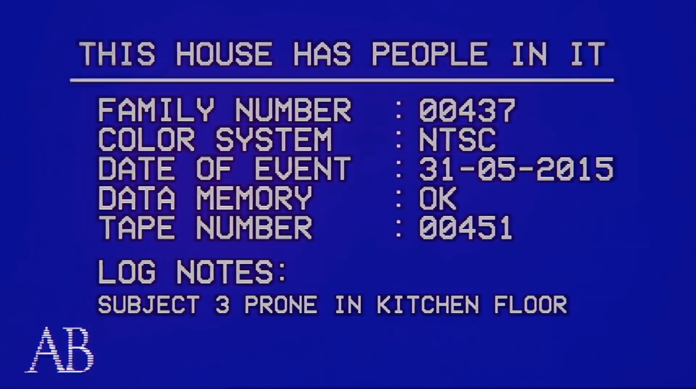

# This House Has People In It

[AB Surveillance Solutions](http://absurveillancesolutions.com/)

###### A place where all of THHPII's files can be downloaded, and viewed easier.

## LOGS/

> ###### stores everything plus option one. (2014/-2016/)
>
> ###### stores full length original video. (ORIGINAL/)
>
> ###### stores video from option three. (X3/)
>
> ###### stores pdf of events in chronological order (CHRONOLOGICAL.pdf/)

## SUBJECTS/

> ###### stores all logs and videos subjects were involved in. (organized by subject number)

## ARCHIVES/

> ###### stores everything from option one.
>
> ###### (texts may look a bit funky, im working on it)

#

#

#

##### This site may contain copyrighted material the use of which has not always been specifically authorized by the copyright owner. We are making such material available in an effort to advance understanding of environmental, political, human rights, economic, democracy, scientific, and social justice issues, etc. we believe this constitutes a ‘fair use’ of any such copyrighted material as provided for in section 107 of the US Copyright Law.

##### In accordance with Title 17 U.S.C. Section 107, the material on this site is distributed without profit to those who have expressed a prior interest in receiving the included information for research and educational purposes. For more information go to: [Cornell Law](http://www.law.cornell.edu/uscode/17/107.shtml)

##### If you wish to use copyrighted material from this site for purposes of your own that go beyond ‘fair use’, you must obtain permission from the copyright owner.
